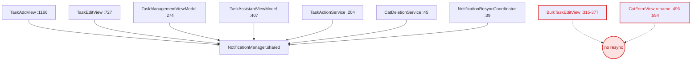
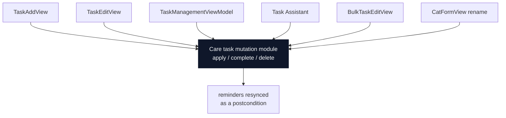
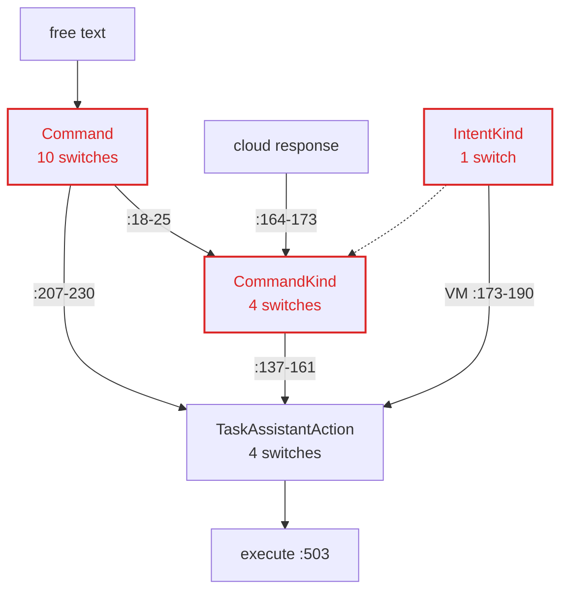
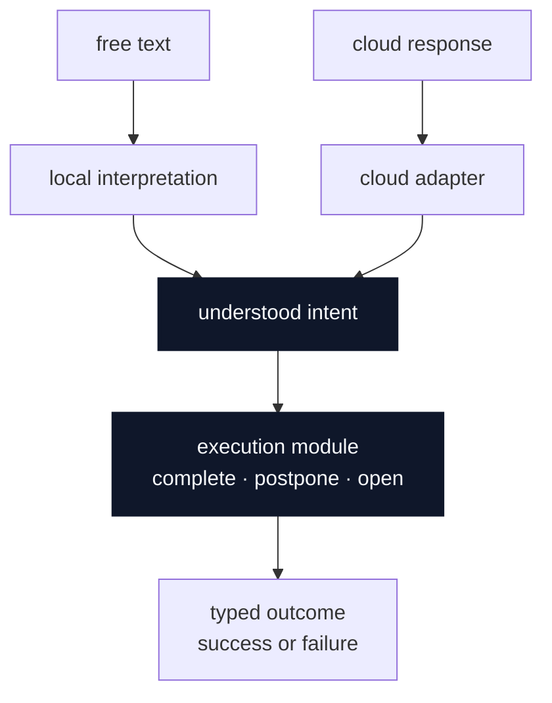
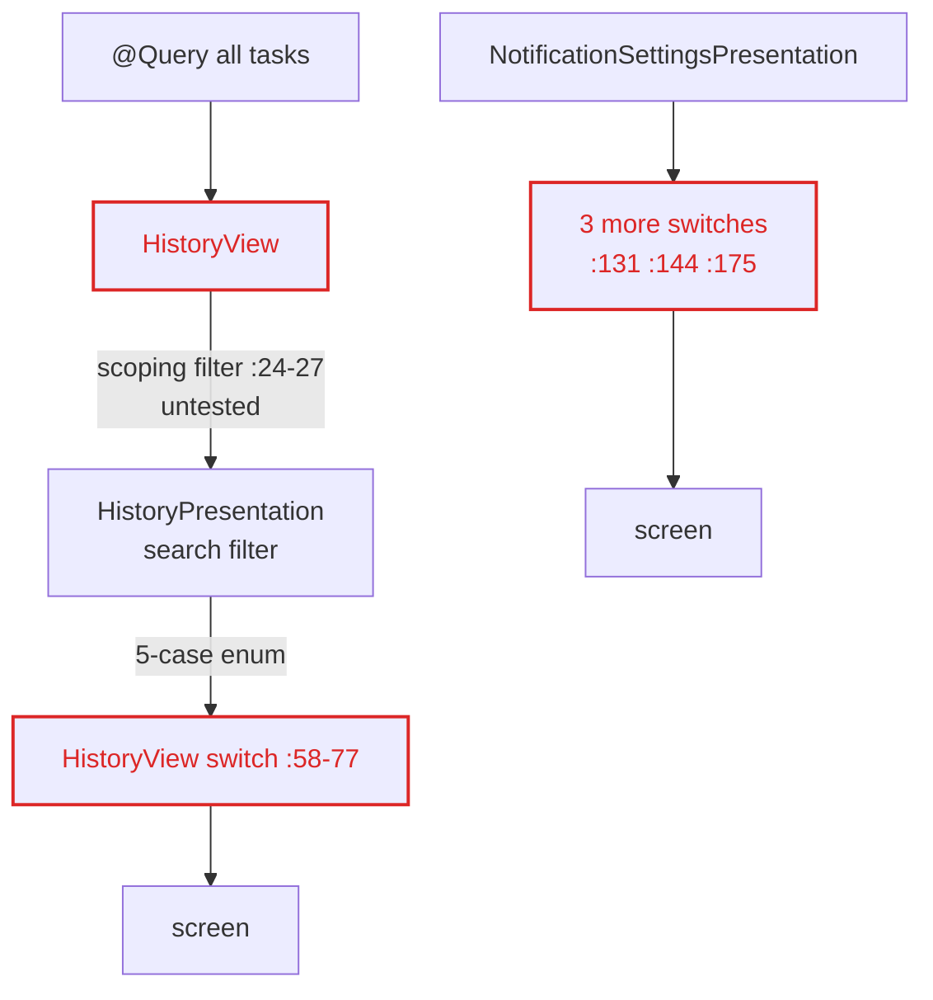
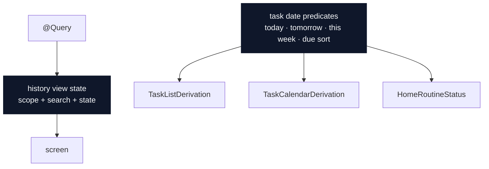
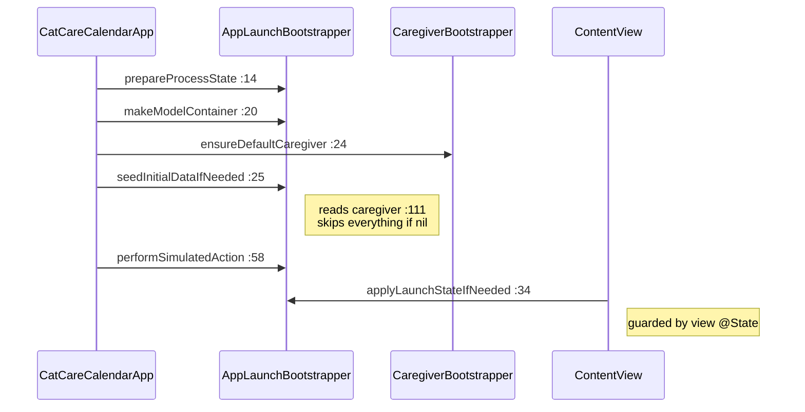
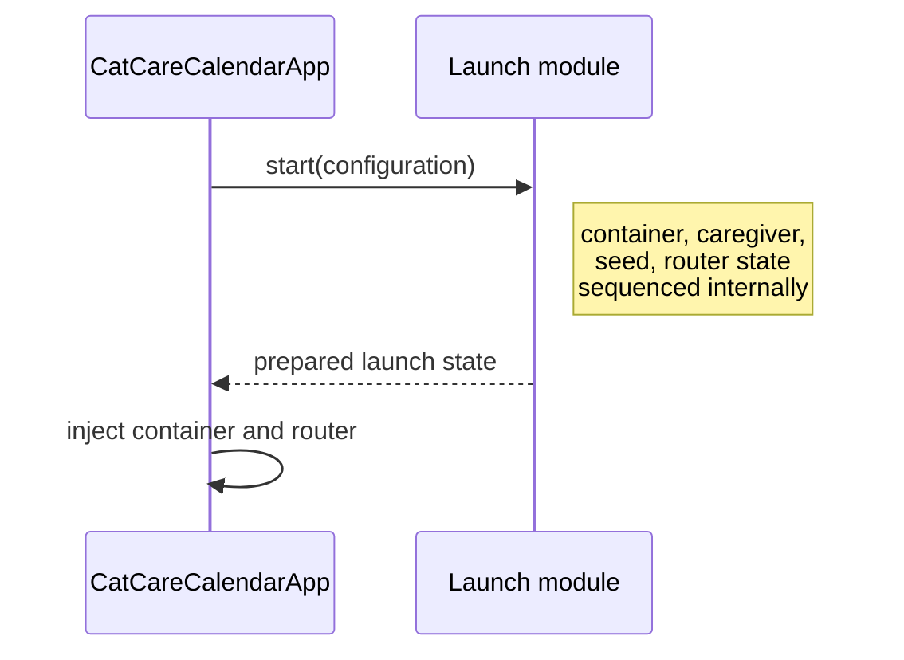

# Architecture review — CatCareCalendar

**31 July 2026** · branch `main` @ `5c6527e` · SwiftUI + SwiftData, iOS 18.4+, one third-party Swift package (`firebase-ios-sdk`)

> **Re-audited 2026-09-08 — read this before you act on anything below.**
>
> This is a dated snapshot of `main` @ `5c6527e`, and `main` has moved. The findings are kept as a
> record; their `path:line` citations are no longer reliable. Corrections found by the documentation
> audit (`docs/agents/doc-audit-2026-09.md`):
>
> - The header used to say "no third-party dependencies". That was **false** even in July: the app
>   links the `firebase-ios-sdk` package. See `CLAUDE.md` § Dependencies.
> - **Issues #12, #13, #14 and #15 are now closed.** The report's "agent-ready" framing and the
>   handoff's frontier table describe July's state. #16–#21 are still open. Check the tracker, and
>   check the code, before you start any of them.
> - Line counts and line numbers quoted below have drifted. Measured 2026-09-08:
>   `TaskAddView.swift` is 663 lines (the report says 1477), `TaskEditView.swift` 792 (781),
>   `CareTask.swift` 749, `NotificationManager.swift` 762. Re-measure before quoting.
> - **Bulk task edit is not a feature of this app, and the code is gone.** The product decision is
>   `docs/adr/0001-no-bulk-task-edit.md`; the removal of `BulkTaskEditView`, `BulkTaskEditService` and
>   their test suite landed on branch `chore/remove-bulk-edit-and-debug-notify`. Confirm with
>   `git grep -l BulkTaskEdit` — no hit means the removal has reached the branch you are on. Every
>   `BulkTaskEditView` citation below is a July record of code that no user could reach and that no
>   longer exists. Do not open those paths, do not fix those defects, and do not read candidate 1's
>   original framing as a statement that a bulk-edit screen ships. Candidate 1's live half is the
>   cat-rename leak.

Seven deepening candidates, produced by steps 1–2 of `/improve-codebase-architecture`. Step 3 (the
grilling loop) was not run — this was an unattended pass, and no interface has been designed yet.

The review was **read-only**: no code was modified, and no build, test or simulator run was performed.
Every claim below is static evidence with a `path:line` citation. Verify before acting on any of it.

Tracked as issues [#12–#21](https://github.com/bckizildemir/CatCareCalendar/issues?q=is%3Aissue+label%3Aready-for-agent%2Cready-for-human).

## Vocabulary

Architecture terms come from `/codebase-design` and are used exactly: **module, interface,
implementation, depth, deep, shallow, seam, adapter, leverage, locality**. Not "component", "service",
"layer", "wrapper", "API" or "boundary".

Domain terms come from [`CONTEXT.md`](../CONTEXT.md), which currently names three: *Quick Action*,
*Assistant Suggestion*, *Task Assistant*. Where the domain has no name for a concept, this report says
so rather than inventing one. Two concepts worth naming during grilling: the recurrence rule
(candidate 2) and the in-flight task form state (candidate 3).

**No ADRs.** `docs/adr/` does not exist, so no candidate contradicts a recorded decision and no
ADR-conflict callouts appear. If a candidate is rejected for a load-bearing reason, that is the moment
to create the directory and record it, so a future review does not re-suggest the same thing.

**`CLAUDE.md` is binding and no candidate contradicts it.** Candidate 1 in particular *strengthens*
the "all local notification scheduling is centralized through `NotificationManager`" rule rather than
replacing it.

## Candidates

| # | Candidate | Strength | Issue |
| --- | --- | --- | --- |
| 1 | [The care-task mutation seam](#1--the-care-task-mutation-seam) | **Strong** | [#16](https://github.com/bckizildemir/CatCareCalendar/issues/16) |
| 2 | [The recurrence rule as a module](#2--the-recurrence-rule-as-a-module) | **Strong** | [#17](https://github.com/bckizildemir/CatCareCalendar/issues/17) |
| 3 | [The task form draft](#3--the-task-form-draft) | **Strong** | [#18](https://github.com/bckizildemir/CatCareCalendar/issues/18) |
| 4 | [One understood intent for the Task Assistant](#4--one-understood-intent-for-the-task-assistant) | Worth exploring | [#19](https://github.com/bckizildemir/CatCareCalendar/issues/19) |
| 5 | [The presentation family: two deep, three shallow](#5--the-presentation-family-two-deep-three-shallow) | Worth exploring | [#20](https://github.com/bckizildemir/CatCareCalendar/issues/20) |
| 6 | [The launch sequence as one interface](#6--the-launch-sequence-as-one-interface) | Worth exploring | [#21](https://github.com/bckizildemir/CatCareCalendar/issues/21) |
| 7 | [One-shot navigation as a value, not six flags](#7--one-shot-navigation-as-a-value-not-six-flags) | Speculative | not ticketed |

Four defects surfaced along the way were split out as directly actionable work:
[#12](https://github.com/bckizildemir/CatCareCalendar/issues/12) bulk edit reminders,
[#13](https://github.com/bckizildemir/CatCareCalendar/issues/13) cat rename,
[#14](https://github.com/bckizildemir/CatCareCalendar/issues/14) caregiver reassignment,
[#15](https://github.com/bckizildemir/CatCareCalendar/issues/15) dead code.

---

## 1 · The care-task mutation seam

**Strong** · in-process · locality · issue [#16](https://github.com/bckizildemir/CatCareCalendar/issues/16)

Every write to a care task must also resync its reminders. Nothing enforces that.

### Files

- `CatCareCalendar/Views/Tasks/BulkTaskEditView.swift:315–377`
- `CatCareCalendar/Views/Tasks/TaskAddView.swift:1156–1187`
- `CatCareCalendar/Views/Tasks/TaskEditView.swift:712–748`
- `CatCareCalendar/Models/TaskManagementViewModel.swift:183–185, 245–249, 272–292`
- `CatCareCalendar/Models/TaskAssistantViewModel.swift:405–428`
- `CatCareCalendar/Utilities/TaskActionService.swift:201–250`
- `CatCareCalendar/Utilities/CatDeletionService.swift:17–65`
- `CatCareCalendar/Utilities/NotificationResyncCoordinator.swift:14–45`
- `CatCareCalendar/Views/Cat/CatFormView.swift:496, 554`

### Before — 8 callers, each rebuilding the DTO

### After — writes go through one interface

**Problem.** Resync is a caller obligation, not a postcondition — so five bulk operations and every cat
rename silently leave reminders stale.

**Solution.** Put every care-task write behind one module whose interface guarantees the reminders
match the store when it returns.

**Wins**

- locality: one place resyncs
- leverage: 8 call sites, one interface
- Delete 8 copies of the 15-field DTO build
- ~~Bulk edit stops orphaning reminders~~ — void since 2026-09-09: bulk edit is not a feature and its code is deleted
- Rename refreshes cat names in bodies
- The interface is the test surface, one spy

> [!WARNING]
> **Evidence of the leak.** `BulkTaskEditView.swift` contains no reference to `NotificationManager` at
> all. Its `.reschedule` arm (`:357–365`) moves `schedule.scheduledDate` and saves; its `.delete` arm
> (`:367–372`) deletes tasks without cancelling — unlike the single-task delete at
> `TaskManagementViewModel.swift:185`. Its `.complete` arm (`:325–342`) writes the completion inline and
> bypasses `TaskActionService.completeTask`, so `handleRecurringCompletion` never runs and a
> bulk-completed recurring task is never advanced.

> [!NOTE]
> **Respects `CLAUDE.md`.** The scheduling stays where it is; what moves behind the interface is the
> *obligation to call it*. `NotificationResyncCoordinator` already has the right shape
> (`activeScheduleInfos()`, `:33`) but is wired to exactly one production trigger —
> `CatCareCalendarApp.swift:48`, settings changes only.

> [!IMPORTANT]
> **Correction — verified 31 July 2026 while building [#12](https://github.com/bckizildemir/CatCareCalendar/issues/12).**
> Every code-level claim above checks out, and all five bulk defects were reproduced as failing tests
> before being fixed. But the framing that candidate 1 is "already shipping wrong behaviour" does not
> hold for the bulk-edit half of it: **`BulkTaskEditView` has no production entry point.** Its only
> references are its own declaration and its own `#Preview` — no view presents it, and there is no
> multi-select mode anywhere in the app. No cat owner can currently reach the screen, so none of the
> five bulk defects can be triggered today. They were latent, not live. The cat-rename leak
> ([#13](https://github.com/bckizildemir/CatCareCalendar/issues/13)) is reachable and remains the
> candidate's live defect.
>
> This also puts candidate 1 in tension with candidate 3's dead-code sweep
> ([#15](https://github.com/bckizildemir/CatCareCalendar/issues/15)): by that ticket's own rule —
> delete what no caller reaches — `BulkTaskEditView` qualifies. Whether the screen gets wired up or
> deleted is a product call that #15 should make explicitly rather than by omission.
>
> **Resolved 2026-09-09.** The owner made that product call: bulk task edit is not a feature. It is
> recorded in `docs/adr/0001-no-bulk-task-edit.md`, and branch
> `chore/remove-bulk-edit-and-debug-notify` deletes `BulkTaskEditView`, `BulkTaskEditService`, their
> test suite, and 22 orphaned `tasks.bulk.*` / `cats.bulk_actions` String Catalog keys. So the five
> bulk defects above are closed by deletion, not by a fix. Everything this block says about the
> cat-rename leak still stands, and it is the whole of candidate 1's live case.

---

## 2 · The recurrence rule as a module

**Strong** · local-substitutable · seam placement · issue [#17](https://github.com/bckizildemir/CatCareCalendar/issues/17)

The domain has no name for "the rule that says when this task comes round again". It is currently
spread across `CareTaskSchedule`, a UI-only `RepeatConfiguration`, and a 15-field notification DTO.

### Files

- `CatCareCalendar/Models/CareTask.swift:426–734` — 299 lines, 40% of the file
- `CatCareCalendar/Models/RepeatConfiguration.swift:53–102`
- `CatCareCalendar/Utilities/NotificationManager.swift:328, 348, 402–465`
- `CatCareCalendar/Utilities/TaskActionService.swift:159–186`
- `CatCareCalendar/Models/TaskCalendarPresentation.swift:4–37`
- `CatCareCalendarTests/Models/CareTaskScheduleTests.swift` — injected calendar
- `CatCareCalendarTests/Utilities/NotificationManagerSchedulingTests.swift` — ambient calendar

### Before — one injectable engine, three ambient wrappers

Read top to bottom as a cross-section of a call. Everything above the seam reads the ambient calendar.

| Band | Calendar source | Testable under a DST-anomalous zone? |
| --- | --- | --- |
| `NotificationManager` trigger construction | `Calendar.current` at `:328`, `:348` | No — no seam at all |
| `calculateNotificationDates` | `Calendar.current` at `:403` | No |
| `effectiveDueDate` | `Calendar.current` at `:427` | No — not injectable |
| — *seam* — | | |
| **occurrence engine** `CareTask.swift:484–724` | `calendar: Calendar`, genuinely injected | **Yes** — all 4 DST-zone tests live here |

The only surface a DST-anomalous zone can be exercised through is the bottom band — which is exactly
where all three recent DST fixes landed.

### After — the seam rises to the top

| Band | What it does |
| --- | --- |
| reminders | asks for occurrences |
| calendar grid | asks for occurrences |
| completion advance | asks for occurrences |
| — *seam* — | |
| **recurrence rule module** | `occurrences(from:limit:calendar:)` — absorbs time-folding, horizon, per-frequency budgets, weekday sets |

One calendar crosses the seam once. Every caller becomes DST-testable for free, including the trigger
construction that today has no seam at all.

**Problem.** The engine is deep but its callers each re-derive due dates and re-read `Calendar.current`
above the seam, so the same recurrence rule is verified from four incompatible test setups and keeps
producing DST bugs.

**Solution.** Raise the seam: one recurrence-rule module that answers "the next N occurrences" and
absorbs time-folding, horizon and per-frequency budgets, with the calendar injected once at the top.

**Wins**

- locality: DST bugs land in one module
- Four test setups collapse to one
- Reminder triggers become DST-testable
- Delete the throwaway schedule rebuild
- leverage: 4 callers, one interface
- Names an unnamed domain concept

> [!WARNING]
> **Two implementations of "fold the time into the date".** `CareTaskSchedule.effectiveDueDate`
> (`CareTask.swift:426`) preserves seconds and resolves a date-only schedule to 23:59:59.
> `NotificationManager.calculateNotificationDates` (`:405–409`) hardcodes `second: 0` and has no
> end-of-day fallback — then rebuilds an unpersisted `CareTaskSchedule` at `:418–424` **without**
> `scheduledTime`, so the engine's own time handling never runs on that path.

> [!CAUTION]
> **The lossy round trip is load-bearing.** `RepeatConfiguration` maps `.year → (.monthly, interval × 12)`
> (`:48`, `:101`) and reverses it heuristically at `:77`; `.biweekly` and `.once` have no output path at
> all (`:71–86`). That multiplication is how a 1188-month interval reached the scheduler — see the
> arguments of `pathologicalIntervalsDoNotScheduleBeyondTheHorizon`
> (`NotificationManagerSchedulingTests.swift:325`), the test written for the horizon fix. The invariant
> "weekday sets only apply to weekly" is re-checked in five places (`CustomRepeatSheet.swift:64`,
> `RepeatConfiguration.swift:92`, `TaskFormPersistence.swift:165`, `TaskAddView.swift:1139`,
> `TaskEditView.swift:702`) and enforced by none.

---

## 3 · The task form draft

**Strong** · in-process · testability · issue [#18](https://github.com/bckizildemir/CatCareCalendar/issues/18)

`TaskFormDraft` is the seam between the form and the store — but it covers half the form, so the other
half is duplicated across two views and one of its fields is never persisted at all.

### Files

- `CatCareCalendar/Views/Tasks/TaskAddView.swift:16–70, 862–913, 1083–1187` — 1477 lines
- `CatCareCalendar/Views/Tasks/TaskEditView.swift:14–46, 541–592, 687–748` — 781
- `CatCareCalendar/Models/TaskFormPersistence.swift:4–19, 34–98`
- `CatCareCalendar/Views/Tasks/TaskConfigurationComponents.swift` — 875
- `CatCareCalendar/Models/TaskCreationSession.swift:54–71`

### Before — the interface is a slice, not a cover

| Module | State it holds | Covered by the draft | Left outside |
| --- | --- | --- | --- |
| `TaskAddView` | 39 `@State` | 20 | **19** — feeding ×11, custom fields, validation errors, repeat config |
| `TaskEditView` | 25 `@State` | 17 | **8** |
| `TaskFormPersistence` | — | 14-field interface, 173-line implementation | — |

23 of `TaskEditView`'s 25 `@State` properties are declared line-for-line identically in `TaskAddView`,
including initializers. The persistence module is shallow relative to what it is asked to own.

### After — one draft module, two thin views

| Module | Holds |
| --- | --- |
| `TaskAddView` | view state only — sheets, focus, pickers |
| `TaskEditView` | view state only — sheets, focus, pickers |
| **task draft module** | `validate()` · `resolveRepeat()` · `resolveCaregiver()` · `commit()`, absorbing validation, repeat resolution, caregiver fallback and custom fields |

**Problem.** Validation, repeat resolution, caregiver fallback and reminder resync all sit above the
draft in two near-identical views, so none of it is testable and the two copies have already diverged.

**Solution.** Move the draft's seam up to the whole form: one module that owns in-flight task state,
validates it, resolves it, and commits it — leaving the views with pickers and sheets.

**Wins**

- Delete 23 duplicated state declarations
- Delete 3 copies of repeat resolution
- Validation gets its first test
- locality: one save path, not four
- Add and Edit stop diverging
- Feeding details reach the store

> [!WARNING]
> **The forms have no tests and the divergence is already real.** Grepping `CatCareCalendarTests/` for
> `TaskAddView`, `TaskEditView`, `saveChanges`, `applyBulkAction` returns zero hits. Meanwhile
> `reminderMinutes` defaults to `0` in Add (`:45`) and `15` in Edit (`:40`); Add hard-fails when no cats
> exist (`:1087`) while Edit only disables the button (`:595–598`); and `updateTask`
> (`TaskFormPersistence.swift:72–98`) never writes `assignedCaregiver` even though the draft carries it —
> caregiver reassignment on edit is a silent no-op. Both save paths swallow their errors to `print`
> (`TaskAddView.swift:1152`, `TaskEditView.swift:708`).

> [!CAUTION]
> **Data the user enters and the app throws away.** `customFieldValues` (`TaskAddView.swift:48`) is read
> at six sites, written at three, and folded into the unsaved-changes snapshot at `:1064` — but neither
> `TaskFormDraft` nor `CareTask` has anywhere to put it. The feeding portion and food type are
> collected, confirmed, and discarded. Separately, 12 of the 15 types in
> `TaskConfigurationComponents.swift` have no reference outside their own file; the cat picker the forms
> actually use is `TaskCatsSelectionView`, not the `CatSelectionSheet` declared there.

---

## 4 · One understood intent for the Task Assistant

**Worth exploring** · ports & adapters · issue [#19](https://github.com/bckizildemir/CatCareCalendar/issues/19)

The **Task Assistant** re-encodes the same complete / postpone / open triple in four parallel enums,
switched over 19 times.

### Files

- `CatCareCalendar/Models/TaskAssistantAction.swift:3–9`
- `CatCareCalendar/Utilities/TaskAssistantInterpreter.swift:13–25, 207–230` — 829
- `CatCareCalendar/Utilities/TaskAssistantResponseFormatting.swift:3–33`
- `CatCareCalendar/Models/TaskAssistantIntentSelection.swift:3–23`
- `CatCareCalendar/Models/TaskAssistantViewModel.swift:173–190, 495–578` — 724
- `CatCareCalendar/Utilities/TaskAssistantCloudInterpreter.swift:137–173`
- `CatCareCalendar/Views/Tasks/TaskAssistantChatView.swift:571–582, 755–762` — 781

### Before — four vocabularies, five conversions

### After — one intent, one execution seam

**Problem.** Adding a fourth assistant verb means editing four enum declarations, five conversion
functions and 19 switches — and the view infers success by reading the chat log.

**Solution.** Collapse the four enums into one understood-intent type, and give the execution module a
typed outcome the view can read instead of the message list.

**Wins**

- 19 switches collapse toward 4
- Delete 5 conversion functions
- Success stops being inferred from prose
- locality: one place to add a verb
- Cloud adapter stops depending on local
- The untested wire becomes testable

> [!WARNING]
> **The wire between the two tested halves is never traversed successfully in any test.**
> `TaskAssistantInterpreterTests` exercises the interpreter as a pure function; `TaskActionServiceTests`
> exercises persistence against a `NotificationSchedulerSpy`. But `taskActionService:` is never passed
> in any `TaskAssistantViewModel` construction across the whole test target, and of the two tests that
> call `confirmPendingAction` one takes the `.open` branch (no persistence) and the other deliberately
> drives the caregiver-unavailable failure (`TaskAssistantViewModelTests.swift:177–196`).
> `completeDetailedTask` (`TaskAssistantViewModel.swift:581–624`) has no coverage at any level, and the
> UI test that reaches the confirm button asserts only that it exists (`CriticalFlowsUITests.swift:380`).

> [!NOTE]
> **The seam is real but asymmetric — don't disturb the part that works.**
> `TaskAssistantCloudInterpreting` (`TaskAssistantCloudInterpreter.swift:5–11`) has two adapters —
> Firebase and `FakeTaskAssistantCloudInterpreter` — so it earns its keep. But its return type is
> `TaskAssistantInterpreter.Interpretation`, a type nested inside the *other* participant, and two of
> that enum's five cases are unreachable from the cloud adapter (`:71–135` can only produce
> `.confirmation` or `.clarification`). The local interpreter has no protocol at all —
> `TaskAssistantViewModel.swift:31` stores it concretely, which is correct: one adapter is a
> hypothetical seam.

---

## 5 · The presentation family: two deep, three shallow

**Worth exploring** · in-process · deletion test · issue [#20](https://github.com/bckizildemir/CatCareCalendar/issues/20)

`CLAUDE.md` calls these the seam business-logic tests target. Two of the five are genuinely deep. Three
are pure functions extracted for testability, and the decisions stayed in the views.

### Files

- `CatCareCalendar/Models/TaskListPresentation.swift` — 266
- `CatCareCalendar/Models/HomeRoutineStatusPresentation.swift` — 173
- `CatCareCalendar/Models/TaskCalendarPresentation.swift` — 73
- `CatCareCalendar/Models/NotificationSettingsPresentation.swift` — 161
- `CatCareCalendar/Models/HistoryPresentation.swift` — 46
- `CatCareCalendar/Views/HistoryView.swift:19–42`, `HomeRoutineStatusRowView.swift:37–46`
- `CatCareCalendar/Views/Tasks/TaskCalendarView.swift:250, 265, 309, 346–396`
- `CatCareCalendar/Views/NotificationSettingsView.swift:131–186`

### Depth cross-section

| Module | Lines | Hidden implementation | Public funcs | Consumers | Verdict |
| --- | --- | --- | --- | --- | --- |
| `TaskListDerivation` | 266 | **48%** | 4 | 2 | deep |
| `HomeRoutineStatusPresentation` | 173 | **57%** | 1 | 1 | deep, wrong outputs |
| `TaskCalendarDerivation` | 73 | 15% | 3 | 1 | mixed |
| `NotificationSettingsPresentation` | 161 | **0%** | 3 | 3 | shallow |
| `HistoryPresentation` | 46 | **0%** | 2 | 1 | shallow |

### Before — the seam cut where SwiftUI types ended

### After — inline the shallow, widen the deep

**Problem.** The seam was drawn where `Color` and `UIApplication` stopped, not where a decision could be
hidden — so the tests assert the side with fewer decisions in it.

**Solution.** Inline the two zero-private modules back into their sole consumers, and pull the date
predicates the views keep re-implementing down into one deep module.

**Wins**

- Five "is today" checks become one
- Three due-date sorts become one
- Delete two zero-implementation modules
- Interface shrinks; implementation absorbs it
- Tests assert what reaches the screen
- locality: date rules in one module

**Duplicated date logic, counted**

| Predicate | Implementations | Where |
| --- | --- | --- |
| "is today" | **5** | `TaskListPresentation.swift:191`, `:222`; `HomeRoutineStatusPresentation.swift:111`, `:162`; `TaskAssistantQuickActionBuilder.swift:11`; `CareTask.swift:381`; `TaskCalendarView.swift:179`, `:201` |
| "is tomorrow" | **3** | `TaskListPresentation.swift:223`; `HomeRoutineStatusPresentation.swift:114`, `:166`; `CareTask.swift:383` |
| due-date sort | **3**, three different nil fallbacks | `TaskListPresentation.swift:253`; `TaskCalendarView.swift:309`; `TaskAssistantQuickActionBuilder.swift:13` |
| "start of week" | **4** | `TaskListPresentation.swift:72`; `HomePageView.swift:267`; `SettingsView.swift:33`; `TaskCalendarView.swift:348`, `:362` |

> [!WARNING]
> **The tested string is not the string on screen.**
> `HomeRoutineStatusPresentation.secondaryTimestampText` (`:139–147`) formats with an injected locale —
> and `HomeRoutineStatusRowView.swift:37–46` throws it away and hardcodes `en_GB_POSIX`. Worse, the
> branch that would use it is unreachable: `rows` only emits a `Row` when `lastCompletionDate` is
> non-nil (`:44–45`). Of the nine `Row` fields, three reach pixels, four reach only VoiceOver, one
> (`sortPriority`) is read nowhere, and one is unreachable. The one test that asserts a string checks
> `primaryRecencyText`, which is never displayed as text.

> [!CAUTION]
> **The deep one's actual complexity is untested.** `TaskListPresentationTests` is 74 lines, 4 tests, all
> calling `filteredTasks(filter: .all)`. `groupedSections`, `taskCounts`, `homeSections`, and every
> day-boundary in `sectionKey` (`:202–230`) appear in no test. Its `referenceDate` parameter is also
> half-honoured — the `.overdue` and `.today` arms route to `CareTask.isOverdue`, whose body ends
> `activeDueDate < Date()` (`CareTask.swift:333`). Three of its six call sites — `filteredCareTasks`,
> `getCareTaskCount`, `groupCareTasksByTime` in `TaskManagementViewModel.swift:104–120` — are called by
> nothing.

---

## 6 · The launch sequence as one interface

**Worth exploring** · in-process · issue [#21](https://github.com/bckizildemir/CatCareCalendar/issues/21)

The app entry point orchestrates 11 collaborators in an order nothing enforces, and the one ordering
constraint that matters fails silently when violated.

### Files

- `CatCareCalendar/CatCareCalendarApp.swift:12–96`
- `CatCareCalendar/ContentView.swift:33–36`
- `CatCareCalendar/Utilities/AppLaunchBootstrapper.swift:36–302` — 489
- `CatCareCalendar/Utilities/CaregiverBootstrapper.swift:11`
- `CatCareCalendar/Utilities/FirebaseBootstrapper.swift:18, 47`
- `CatCareCalendarTests/TestSupport/TestModelContainerFactory.swift:6–15`

### Before — five entry points, order by convention

### After — one call, order enforced by types

**Problem.** The ordering constraints are part of the interface but live only in comments, and the
caregiver-before-seed dependency fails by producing an empty database rather than an error.

**Solution.** One launch module that takes the configuration and returns a prepared launch state,
sequencing container, caregiver, seed and router internally.

**Wins**

- Ordering moves from comments to types
- Entry point learns one interface, not five
- Launch becomes testable end to end
- Tests stop duplicating the schema
- locality: launch failures in one module
- `ContentView` stops bootstrapping

> [!CAUTION]
> **The silent-failure path.** `seedInitialDataIfNeeded` fetches the caregiver at
> `AppLaunchBootstrapper.swift:111` and gates every fixture on `if let cat, let caregiver` (`:113`). If
> `CatCareCalendarApp.swift:24` had not run first, `defaultCaregiver` returns nil, every fixture is
> skipped, and `context.save()` at `:128` still succeeds. Coverage is thin either way:
> `prepareProcessState`, `makeModelContainer`, `performSimulatedNotificationActionIfNeeded`,
> `FirebaseBootstrapper` and the whole of `CatCareCalendarApp.init()` have zero tests, and
> `TestModelContainerFactory.swift:8–15` re-declares the model list rather than calling the production
> factory — so a schema change can pass tests and crash on launch.

---

## 7 · One-shot navigation as a value, not six flags

**Speculative** · in-process · **not ticketed**

`NavigationRouter.handle(_:)` re-zeroes the same six fields by hand in six branches — 36 assignments —
and four of them must be reset again by whichever view consumes them.

### Files

- `CatCareCalendar/Utilities/NavigationRouter.swift:9–16, 50–114`
- `CatCareCalendar/Views/Tasks/TaskManagementView.swift:52–82`
- `CatCareCalendar/Views/HistoryView.swift:20–21, 90`
- `CatCareCalendar/Views/SettingsView.swift:57–62, 153–154`
- `CatCareCalendarTests/Utilities/NavigationRouterTests.swift:48, 68, 88, 110`

### Before — 6 fields × 6 route branches, all hand-written

| Route branch | Assignments | Covered by a router test |
| --- | --- | --- |
| `.tasks` | 6 | yes |
| `.assistant` | 6 | yes |
| `.settings` | 6 | **no** |
| `.cats` | 6 | **no** |
| `.history` | 6 | yes |
| `.catDetail` | 6 | yes |

After the route sets them, four fields must be cleared again by the consuming view.
`selectedTaskId` already needed a second manual reset added at `TaskManagementView.swift:79–82`
because `.onChange` does not fire on a cold tab mount; the comment at `:75–78` records that bug
shipping.

**Problem.** Six mutable fields carry two different meanings — durable selection and one-shot command —
and nothing in their types tells a caller which reset it owes.

**Solution.** Model the pending navigation as one value the router replaces wholesale and the consumer
takes, so a route sets one field and consumption is the reset.

**Wins**

- 36 assignments become 6
- Adding a route stops touching 6 branches
- Stale-flag leaks stop being possible
- One-shot and selection stop sharing a type

> [!NOTE]
> **Why speculative, and why it was not ticketed.** `CLAUDE.md:47–48` explicitly blesses the current
> consume-and-reset pattern and names `NavigationRouter` the single entry point for cross-tab
> navigation. The pattern has produced exactly one recorded bug, and `NavigationRouterTests` already
> pins four of the six branches. Worth reopening only if a seventh flag is about to be added.

---

## Top recommendation

### [1 · The care-task mutation seam](#1--the-care-task-mutation-seam) — issue [#16](https://github.com/bckizildemir/CatCareCalendar/issues/16)

It is the only candidate where the missing depth is already shipping wrong behaviour: five bulk
operations and every cat rename leave reminders pointing at stale times, stale names, and deleted
tasks — because resync is something a caller must remember rather than something an interface
guarantees. The fix concentrates eight copies of the same 15-field build into one module, and the seam
it needs already half-exists in `NotificationResyncCoordinator`.

> [!IMPORTANT]
> **Corrected 2026-09-09.** The five bulk operations are gone: bulk task edit is not a feature and its
> code is deleted (see the banner at the top of this file). Read this recommendation as resting on the
> cat-rename leak alone. The caller-obligation argument and the duplicated 15-field build survive the
> deletion, so #16 is still worth doing — but count the call sites again before you quote eight.

Take [candidate 2](#2--the-recurrence-rule-as-a-module) second — the recurrence rule is the other half
of the same story, and the three recent DST and horizon fixes are the evidence that its seam sits one
layer too low. [Candidate 3](#3--the-task-form-draft) is the largest by line count but the least urgent
by risk: the duplication is loud and static, whereas 1 and 2 are quiet and produce bugs.

### Suggested order of work

1. **[#12](https://github.com/bckizildemir/CatCareCalendar/issues/12), [#13](https://github.com/bckizildemir/CatCareCalendar/issues/13)** — the two shippable defects behind candidate 1. No design needed.
2. **[#16](https://github.com/bckizildemir/CatCareCalendar/issues/16)** — the mutation module, once those are green. Grill the interface first.
3. **[#17](https://github.com/bckizildemir/CatCareCalendar/issues/17)** — the recurrence rule. Independent of the above; can run in parallel.
4. Everything else on the frontier.

Issues **#16–#21 are deepenings, not implementations.** A chosen deepening belongs in `/grill-with-docs`
first, then `/to-spec`. Do not open one and start editing Swift — the interface has not been designed.
